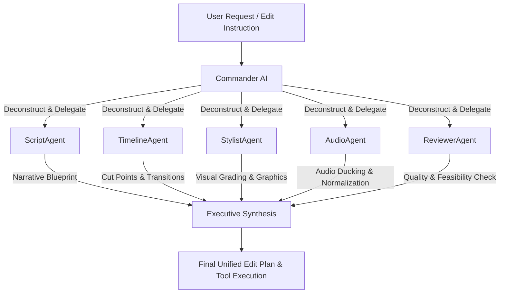

# MediaMogul Skill Guide

`MediaMogul` is an agentic AI copilot and autonomous video manipulation platform engineered directly for **Shotcut Video Editor**. It integrates multi-model sub-agent orchestration, ultra-lightweight project collaboration packs, and over 50 real video/audio manipulation capabilities powered by FFmpeg, Shotcut MLT XML manipulation, OpenAI `gpt-5.6-luna`, Whisper speech-to-text, and DALL-E 3 visual synthesis.

---

## 1. Multi-Agent Commander Swarm Architecture

`MediaMogul` features a hierarchical Commander & Sub-Agent Swarm architecture. When enabled, a single user prompt is decomposed and processed simultaneously by 5 specialized AI instances before being synthesized into an executive edit plan.

### Specialized Sub-Agents

| Sub-Agent | Role | Responsibilities |
|---|---|---|
| **🎖️ Commander** | Orchestrator & Executive Synthesizer | Coordinates sub-agents, resolves conflicting recommendations, outputs unified production plan and machine-executable tool JSON. |
| **📝 ScriptAgent** | Narrative & Voice Director | Analyzes storytelling arc, hook pacing, narration, subtitles, and viral retention. |
| **⏱️ TimelineAgent** | Pacing & Transition Engineer | Determines cut points, scene split thresholds, speed ramps, framerates, and MLT transitions. |
| **🎨 StylistAgent** | Visual & Color Designer | Manages aspect ratios (16:9 widescreen vs 9:16 vertical), color LUTs, lower thirds, progress bars, and DALL-E 3 B-Roll. |
| **🔊 AudioAgent** | Sound & Loudness Engineer | Directs loudness normalization (-14 LUFS), audio ducking under speech, denoising, and TTS voices. |
| **🧐 ReviewerAgent** | Quality Control & Safety Inspector | Verifies file integrity, checks bitrate stats, black frame gaps, and subtitle synchronization. |

### Parallel Execution Pipeline


---

## 2. Video Editor Collaboration & Export Hub

`MediaMogul` solves collaborative video editing handoffs by distinguishing between lightweight project data and heavy media binaries.

### Export Formats

#### A. Single Action Log (`.txt` / `.md`)
- A single comprehensive document containing the entire chronological session history:
  - Session startup and environment info.
  - All conversational turns between user, Commander, and sub-agents.
  - Every tool executed, exact parameters used, and execution outcomes.
  - Complete list of tracked media files with Windows system file URIs (`file:///...`).

#### B. Lightweight Collaboration Pack (`.zip`)
- **Featherweight archive for instant sharing** across Discord, Slack, or Email (usually < 500 KB).
- **Contains only lightweight files**:
  - Shotcut project files (`.mlt`)
  - Subtitle files (`.srt`)
  - Voiceover transcripts & text documents (`.txt`, `.json`)
  - Session action history logs (`session_action_history.json`)
  - Media Manifest (`media_manifest.json`)
- **ZERO heavy images or videos are packaged into the zip**. Heavy media files are cataloged with system links (`file:///C:/path/to/media.mp4`), MD5 checksums, resolution, and bitrates. Another editor receiving the zip can relink to local media files immediately or mirror the directory structure.

#### C. Master Turnkey Archive (`.zip`)
- Complete self-contained production bundle.
- Packages all project files, transcripts, subtitles, and copies **all heavy media files** (MP4, MOV, WAV, PNG, JPG) into a dedicated `media/` folder inside the archive for turnkey 100% offline collaboration.

### Media Manifest Schema (`media_manifest.json`)
```json
{
  "manifest_version": "1.0.0",
  "generated_at": "2026-09-04T18:30:00Z",
  "media_count": 4,
  "media_files": [
    {
      "path": "C:\\Videos\\Interview_CamA.mp4",
      "name": "Interview_CamA.mp4",
      "system_link": "file:///C:/Videos/Interview_CamA.mp4",
      "extension": ".mp4",
      "is_heavy": true,
      "size_bytes": 145829104,
      "exists": true
    },
    {
      "path": "C:\\Videos\\Interview_CamA.srt",
      "name": "Interview_CamA.srt",
      "system_link": "file:///C:/Videos/Interview_CamA.srt",
      "extension": ".srt",
      "is_heavy": false,
      "size_bytes": 4820,
      "exists": true
    }
  ]
}
```

---

## 3. Catalog of 50+ Video Editing Capabilities

The AI agent invokes real, physical media manipulations using structured tool execution blocks.

### Core Capabilities
0. `add_to_timeline(input_path, mlt_path, in_time, out_time, open_in_shotcut, output_path)`: Adds clip into Shotcut .mlt timeline project and opens in Shotcut.
1. `create_multiverse_timelines(input_path, output_dir, open_in_shotcut, primary_universe)`: Simultaneously spawns 5 parallel multiverse timelines (Alpha: Director's Cut, Beta: Viral Jump Cut, Gamma: Elements & SFX, Delta: Split Matrix A/B, Omega: All-in-One Multi-Track Master Stack).
2. `branch_timeline_universe(parent_mlt, branch_name, modification_type, open_in_shotcut)`: Branches an existing Shotcut timeline into an alternate universe cut (noir, cinematic warm, custom).
3. `overlay_shotcut_element(input_path, element_name, timestamp, duration_sec, position, scale, sound_effect)`: Injects an animated sticker, emoji, graphic, or sound effect from Shotcut's built-in library (1,200+ elements) onto a dedicated overlay timeline track (V2).
4. `auto_add_elements(input_path, theme, count, position, sound_sync)`: Automatically populates the dedicated Elements timeline track (V2) with themed stickers (celebration, halloween, youtube, coding, gaming) and synchronized SFX.
5. `trim_video(input_path, start_time, end_time, output_path)`: Precision cut/trim.
2. `convert_vertical(input_path, output_path)`: Crops 16:9 widescreen to 9:16 vertical for TikTok, YouTube Shorts, and Instagram Reels.
3. `extract_audio(input_path, output_path)`: Strips audio into clean MP3/WAV.
4. `burn_subtitles(video_path, srt_path, output_path)`: Hardcodes styled subtitles directly onto video frames.
5. `change_speed(video_path, speed, output_path)`: Accelerates or decelerates video and audio with pitch preservation.
6. `extract_thumbnail(video_path, timestamp, output_path)`: Grabs high-res still frame at exact timestamp.
7. `compress_video(video_path, target_mb, output_path)`: Optimizes video bitrate to fit Discord/email limits.
8. `modify_mlt(mlt_path, filter_type, properties, output_path)`: Injects native MLT XML filters directly into Shotcut projects.
9. `generate_subtitles(media_path)`: Whisper AI speech-to-text with synchronized `.srt` generation.
10. `generate_voiceover(text, voice, output_path)`: OpenAI studio TTS narration.
11. `generate_broll(prompt, size, output_path)`: DALL-E 3 16:9 or 9:16 image generation.

### 40 Advanced Capabilities

#### Audio & Sound Engineering
12. `detect_silence(input_path, noise_threshold_db, min_duration_sec)`: Finds silent gaps in audio/video clips for automatic jump-cutting.
13. `fade_audio(input_path, fade_in_sec, fade_out_sec, output_path)`: Smooth audio head and tail fades.
14. `normalize_loudness(input_path, target_lufs, output_path)`: EBU R128 / ITU BS.1770 broadcast loudness normalization (default -14 LUFS for YouTube/Spotify).
15. `audio_ducking(background_audio, voice_audio, output_path)`: Dynamically attenuates background music when voiceover speech is present.
16. `denoise_audio(input_path, output_path)`: Suppresses background hiss, hum, and ambient mic noise via highpass/lowpass filtering.
17. `remove_audio(input_path, output_path)`: Strips all audio tracks, producing a pure silent video stream.
18. `mux_audio_video(video_path, audio_path, output_path)`: Multiplexes separate video and audio sources into a single file.
19. `audio_waveform(audio_path, width, height, output_path)`: Renders animated visual audio waveform graphics from music or speech.

#### Timing, Motion & Scene Analysis
20. `reverse_video(input_path, output_path)`: Reverses video frames and audio playout backwards.
21. `loop_video(input_path, loop_count, output_path)`: Loops video seamlessly N times for social media backgrounds.
22. `split_scenes(input_path, threshold)`: Detects cut points using frame difference analysis and splits clips into individual scene files.
23. `detect_black_frames(input_path)`: Identifies black frame intervals to diagnose blank gaps or scene transitions.
24. `speed_ramp(input_path, speed_multiplier, output_path)`: Smoothly transitions clip speed for dramatic motion effects.
25. `change_framerate(input_path, target_fps, output_path)`: Conforms frame rate (24p, 30p, 60p) with motion interpolation.
26. `burn_timecode(input_path, fps, output_path)`: Burns visible SMPTE timecode (HH:MM:SS:FF) onto video for client review.

#### Layout, Composition & Social Formatting
27. `add_watermark(video_path, watermark_image, position, output_path)`: Overlays a logo or watermark at `top_left`, `top_right`, `bottom_left`, `bottom_right`, or `center`.
28. `create_gif(input_path, start_time, duration, fps, width, output_path)`: Generates optimized, high-fidelity animated GIFs with 2-pass palette generation.
29. `render_progress_bar(input_path, bar_color, bar_height, output_path)`: Renders an animated bottom progress bar across social video clips.
30. `render_lower_third(input_path, line1, line2, output_path)`: Burns in a graphic lower-third banner with speaker name and title.
31. `split_screen(video1_path, video2_path, output_path)`: Combines two video streams side-by-side.
32. `picture_in_picture(background_video, overlay_video, position, scale, output_path)`: Composes a picture-in-picture overlay at customizable scale and screen corners.
33. `flip_video(input_path, direction, output_path)`: Flips video horizontally or vertically (useful for selfie cam mirroring).
34. `rotate_video(input_path, degrees, output_path)`: Rotates video 90°, 180°, or 270°.
35. `credits_roll(credits_text, duration, output_path)`: Generates an upward scrolling movie credits roll video.
36. `slideshow_from_images(image_paths, duration_per_image, output_path)`: Converts a sequence of still images into a continuous video slideshow.
37. `concat_videos(video_paths, output_path)`: Concatenates multiple video segments into a continuous final sequence.
38. `storyboard_grid(video_path, cols, rows, output_path)`: Renders an evenly spaced contact sheet grid summarizing the entire video.

#### Color Grading & Visual Filters
39. `adjust_color(input_path, brightness, contrast, saturation, output_path)`: Realtime color balance adjustments.
40. `blur_video(input_path, blur_radius, output_path)`: Applies customizable box/gaussian blur to video.
41. `color_lut(input_path, lut_name, output_path)`: Applies cinematic color grading presets (`warm`, `cool`, `vintage`, `cyberpunk`, `bw`).
42. `extract_keyframes(input_path, output_dir)`: Extracts all I-Frames (intra-coded keyframes) from video.

#### Project Automation & Metadata
43. `generate_chapters(input_path, chapters, output_path)`: Generates YouTube chapter timestamps with descriptions.
44. `extract_transcript(media_path, output_path)`: Full transcription to formatted `.txt` narrative document.
45. `mlt_add_transition(mlt_path, transition_type, duration_frames, output_path)`: Inserts Shotcut MLT transitions between clips.
46. `mlt_set_gain(mlt_path, gain_db, output_path)`: Adjusts MLT audio gain property non-destructively.
47. `mlt_crop_filter(mlt_path, top, bottom, left, right, output_path)`: Injects non-destructive MLT crop filter.
48. `mlt_blur_filter(mlt_path, radius, output_path)`: Injects non-destructive MLT blur filter.
49. `export_edl(mlt_path, output_path)`: Converts Shotcut `.mlt` timeline to industry standard CMX 3600 EDL for Premiere Pro/DaVinci Resolve interchange.
50. `batch_rename(directory, pattern, ext)`: Automatically renames raw camera footage files with sequential indexing.
51. `calculate_stats(input_path)`: Reads codec, duration, dimensions, framerate, and audio channel info.

#### Multimodal Vision & Frame Composition Analysis
52. `extract_frame(input_path, timestamp, output_path)`: Extracts an individual video frame from raw video or `.mlt` timeline as a high-quality JPEG for AI digestion.
53. `capture_timeline_preview(output_path)`: Directly captures the live Shotcut video preview player window from the screen as a JPEG, capturing the exact full-timeline work-in-progress state with all live filters, transitions, and cuts.
54. `analyze_frame(input_path, timestamp, prompt)`: Sends a JPEG frame to OpenAI Multimodal Vision AI (`gpt-4o`) for an in-depth cinematographic critique:
    - **Rule of Thirds & Framing**: Grid alignment, horizon balance, leading lines.
    - **Headroom & Lead Room**: Subject gaze direction and breathing space.
    - **Safe Zones**: 16:9 Title Safe and 9:16 vertical safe areas (preventing TikTok/Reels UI overlay clash).
    - **Lighting & Exposure**: Contrast ratios, skin tones, clipping detection.
    - **Actionable Shotcut Timeline Fixes**: Concrete recommendations for crops, MLT color LUTs, vignettes, and subtitle positioning.

---

## 4. Dangerous High-Token Mode & Sliding Memory Window

By default, conversational context is managed via token estimation (`len(text) / 3.8`) with a safety window of **8,192 tokens** to protect API allowances.

### Dangerous Mode Toggle
- Located in **Settings & Dock** tab.
- Unlocks context history up to **128,000 tokens** and responses up to **8,192 tokens**.
- Allows multi-hour sessions where the AI agent retains memory of every edit, filename, and creative decision made across hundreds of turns.
- Status badge switches to: `⚠️ Unlocked: ~{tokens} / {limit} tokens ({msgs} msgs)`.

---

## 5. Typical Workflows

### Workflow 1: Turning Long Landscape Video into a Viral Vertical Short
1. User prompt: *"Turn my long video C:/Videos/Podcast.mp4 into a 30-second vertical TikTok with burned subtitles and loudness normalization."*
2. Commander decomposes request:
   - `TimelineAgent` suggests trim `00:01:15` to `00:01:45`.
   - `StylistAgent` chooses `convert_vertical`.
   - `AudioAgent` recommends `normalize_loudness` (-14 LUFS).
   - `ScriptAgent` calls `generate_subtitles` and `burn_subtitles`.
3. Tool sequence executes and outputs final polished short.
4. User clicks **Export Lightweight Collab Pack** to send the `.mlt`, `.srt`, and manifest to their remote co-editor.

### Workflow 2: Collaboration Handoff to Remote Video Editor
1. In the **🤝 Collaboration & Packs** tab, click **Add Media File** to ensure all project assets are indexed.
2. Click **Export Lightweight Collab Pack (.zip)**.
3. Send the resulting small `.zip` file over Discord or Slack.
4. The receiving editor unzips the file; the included `media_manifest.json` provides all system URIs (`file:///...`) and MLT timeline mappings.

### Workflow 3: Analyzing Frame Composition on Raw Footage & Timeline Work-in-Progress
1. In the **🖼️ Vision & Composition** tab:
   - Select **📹 Raw Video Clip** or **📁 Shotcut Timeline Project (.mlt)** or **🖥️ Live Shotcut Viewport Preview**.
   - Input the target timestamp (e.g. `00:00:04.500`).
   - Click **📸 1. Extract / Capture JPEG Frame** to view the live thumbnail and resolution details.
   - Click **🧠 2. Analyze Frame with Vision AI** (or enter a custom critique question like *"Is there room for a 2-line lower third here without blocking the face?"*).
2. The AI returns a comprehensive Director of Photography breakdown covering rule of thirds, safe zones, lighting balance, and actionable Shotcut filter directives.

---

## 5. Modular Clean Code Architecture

The MediaMogul codebase is decomposed into high-cohesion, low-coupling modules:

```
companion/
├── core/
│   ├── ffmpeg_utils.py      # Binary paths, timestamps, audio extraction, token pruning
│   ├── media_tracker.py     # MediaLibraryTracker, manifests, lightweight & master zip packs
│   ├── commander.py         # Multi-agent swarm (Script, Timeline, Stylist, Audio, Reviewer)
│   ├── agent_engine.py      # System prompt, tool execution dispatching, completions
│   └── shotcut_remote.py    # Win32 remote transport control (Play/Pause, Split, Ripple Del, Undo)
├── tools/
│   ├── audio_tools.py        # Silence detection, normalization, ducking, TTS, waveforms
│   ├── video_edit_tools.py   # Trimming, vertical 9:16 crop, speed ramps, framerate, scene splits
│   ├── visual_fx_tools.py    # Watermarks, color LUTs, lower thirds, GIFs, DALL-E 3 B-Roll
│   ├── mlt_tools.py          # Shotcut MLT project XML modifiers, filters, EDL export
│   ├── subtitles_tools.py    # Whisper STT, SRT conversion, subtitle burning, chaptering
│   ├── vision_tools.py       # Frame JPEG extraction, Shotcut viewport capture, Vision AI
│   ├── auto_director_tools.py# 1-Click Magic Roughcut (.mlt) & Viral Shorts 9:16 repurposer
│   └── sfx_tools.py          # Procedural cinematic sound effects synthesizer (WAV generator)
├── ui/
│   ├── top_bar.py           # Win32 docked overlay button next to Shotcut Help menu
│   ├── remote_bar.py        # Embedded Shotcut Timeline transport & hotkey controller
│   ├── agent_tab.py         # AI Agent Chat console, token gauge, swarm toggle
│   ├── director_tab.py      # AI Auto-Director & 1-Click Viral Shorts Repurposer Studio
│   ├── sfx_tab.py           # Cinematic SFX Synthesizer & Sound Designer with live audition
│   ├── subtitles_tab.py     # Whisper audio extraction and .srt subtitle generator
│   ├── voiceover_tab.py     # OpenAI TTS studio (alloy, echo, fable, onyx, nova, shimmer)
│   ├── broll_tab.py         # DALL-E 3 visual prompt studio & image downloader
│   ├── inspector_tab.py     # Shotcut .mlt project structure & clip inspector
│   ├── vision_tab.py        # Frame JPEG preview & AI composition critique studio
│   ├── collab_tab.py        # Single action log, lightweight pack, and master turnkey exporter
│   └── settings_tab.py      # API key, model selection, shotcut executable, dangerous mode
├── mediamogul_tools.py           # Unified facade re-exporting all core and tool modules
└── mediamogul_agent_center.py    # Main window coordinator linking UI tabs with agent engine

filters/mediamogul/
├── ui.qml                   # Main Shotcut QML filter interface
├── mediamogulPresets.js          # Dynamic video styling presets & geometry modifiers
├── OpenAiClient.js          # Asynchronous XMLHttpRequest client for OpenAI
└── mediamogulStorage.js          # Local SQLite storage for API keys and preferences
```
